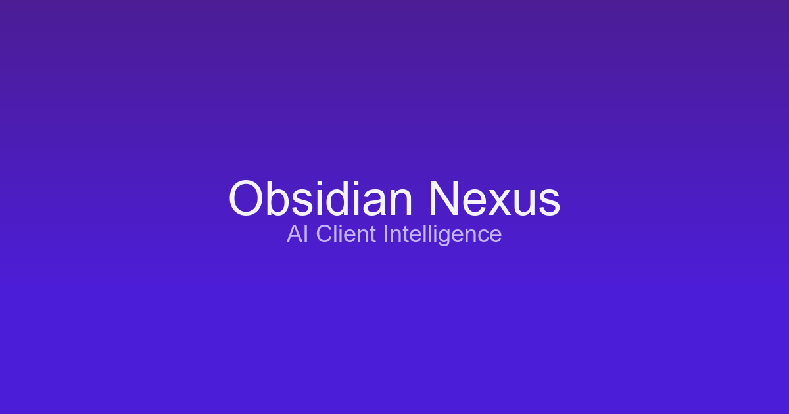

# Obsidian Nexus

Enterprise-grade client intelligence SaaS demonstrating senior-level craft with Next.js, Prisma, and shadcn/ui.

## Project Overview
Obsidian Nexus centralizes enterprise client data (accounts, contacts, interactions, tasks) and adds AI-generated health insights so revenue teams can prioritize the right work. The app pairs luxury SaaS visuals with hardened auth, RBAC, and deployment-ready infrastructure.

## Tech Stack
- Next.js 16 App Router with Server Actions and Turbopack
- TypeScript, Tailwind CSS, shadcn/ui, Framer Motion, Lucide icons
- Prisma ORM + Supabase Postgres (connection pooling) + NextAuth v5
- Google Generative AI SDK (Gemini 1.5) with deterministic fallbacks
- ESLint 9, Vitest, Playwright, Docker, Vercel

## Key Features
- Secure authentication with credential-based NextAuth v5, JWT sessions, and RBAC-aware layouts
- AI health summaries, playbooks, and insight cards with graceful fallback copy
- Full CRUD for accounts with optimistic UI, drawers, filtering, pagination, and audit-friendly server actions
- Task orchestration, insight generation, and mock dataset fallback for DB-less previews
- Deployment-hardened middleware, `.vercelignore`, standalone builds, and Supabase connection pooling defaults

## AI Capabilities
Gemini 1.5 ingests account revenue, health, recent interactions, and open tasks to craft executive-ready summaries plus next-best actions. When the AI key is absent or rate limited, deterministic heuristics provide reliable guidance so the dashboard always feels alive.

## Live URL
https://obsidian-nexus-ochre.vercel.app/

## GitHub Repo URL
https://github.com/Ankittsharma07/Obsidian-Nexus

**This project is designed with real-world scalability, security, and enterprise UX in mind.**

## Getting Started
```bash
git clone https://github.com/Ankittsharma07/Obsidian-Nexus.git
cd Obsidian-Nexus
npm install
cp .env.example .env.local
```
Update the variables below, then generate Prisma assets and run the dev server:
```bash
npx prisma generate
npx prisma migrate dev
npx prisma db seed
npm run dev
```
Visit http://localhost:3000 for the landing page and http://localhost:3000/sign-in for the console (seed user `ava@obsidian.dev` / `changeme`).

## Environment Setup
Populate the `.env.local` file with your secrets (database URLs, NextAuth settings, optional AI keys, etc.). Keep these values private—never commit actual secrets. Refer to `VERCEL_ENV_SETUP.md` for the complete variable checklist.

## Development Workflow
- `npm run lint` - ESLint 9 ruleset
- `npm run test` - Vitest unit tests
- `npm run test:e2e` - Playwright smoke tests
- `npm run build` - Production build to validate server actions and Prisma types

## Architectural Notes
- App Router layouts split `(auth)` and `(dashboard)` areas with Suspense boundaries and server components.
- Middleware guards `/clients`, `/tasks`, and `/settings` using lightweight cookie checks under 5 KB.
- Prisma client is shared via a singleton (`src/lib/prisma.ts`) for both server actions and route handlers.
- Mock data (`src/lib/mock-data.ts`) keeps demos functional when `DATABASE_URL` is absent locally.
- Supabase pooling + `output: 'standalone'` in `next.config.ts` ensures Vercel deploys stay under size limits.

## Deployment Checklist
1. Push latest code to GitHub; Vercel auto-builds using standalone output.
2. Configure environment variables across Production, Preview, and Development (use pooling URL and actual `NEXTAUTH_URL`).
3. Run `npx prisma migrate deploy` and `npx prisma db seed` against Supabase before production traffic.
4. Verify `/sign-in`, `/sign-up`, `/clients`, `/tasks`, and `/api/accounts` on the live URL.

## Personalization Tips
- Update `src/components/layout/site-footer.tsx` with your own name, GitHub, and LinkedIn links before sharing.
- Extend mock data or add providers to showcase performance/monitoring integrations as needed.
- Swap `og.png` with a custom hero image to match your brand.

Happy building and shipping!
